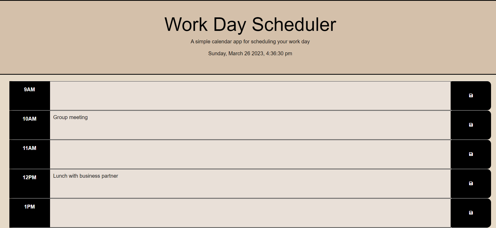
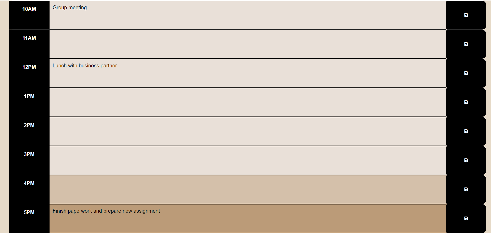

# work-day-scheduler

## Description

In this challenge, I was asked to add important events to a daily planner for effective time management. Starter code was given for this assignment.

## Table of Contents 

Please refer to Table Of Contents.
- [Criteria](#criteria)
- [Screenshot](#screenshot)
- [Link To Deployed Application](#link-to-deployed-application)

## Criteria

- GIVEN I am using a daily planner to create a schedule
- WHEN I open the planner
- THEN the current day is displayed at the top of the calendar
- WHEN I scroll down
- THEN I am presented with time blocks for standard business hours
- WHEN I view the time blocks for that day
- THEN each time block is color-coded to indicate whether it is in the past, present, or future
- WHEN I click into a time block
- THEN I can enter an event
- WHEN I click the save button for that time block
- THEN the text for that event is saved in local storage
- WHEN I refresh the page
- THEN the saved events persist

CREDIT NOTES: I worked with ASKBot in Slack on past, present and future color change. I had a spelling error. 

## Screenshot 

Please reference the gif and photos for the Work Day Scheduler Project.

## Link To Deployed Application

Please refer to deployed application directly:

[Code Quiz](https://susorocode.github.io/work-day-scheduler/)